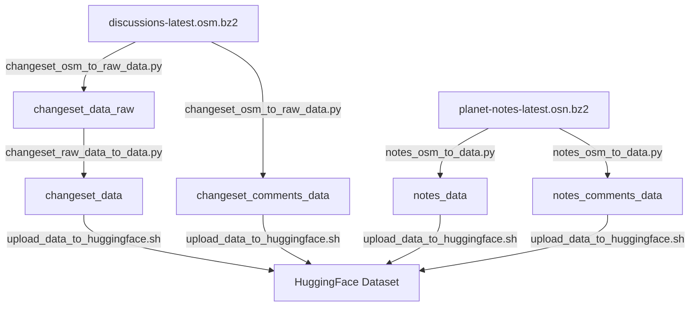

# OpenStreetMap Statistics


Monthly updated [data](https://huggingface.co/datasets/piebro/osm-data) and [statistics](https://piebro.github.io/openstreetmap-statistics) of OpenStreetMap.

My motivation for this project was that I couldn't find some statistics I was interested in or that the data was outdated.
That's why I created these statistics and preprocessed data, which are easily updatable with a simple script run locally or with GitHub actions.

There was a big refactor recently (2025-10-11). The old version is still available at https://piebro.github.io/openstreetmap-statistics/archive/.

## Usage

The statistics website is a showcase of what you can do with the data. If you want to create your own special plots or tables, you can use the preprocessed data.

There are 4 different datasets that can be queried:
- changeset_data (the main dataset with all changesets)
- changeset_comments_data (comments on changesets)
- notes_data (notes on the map)
- notes_comments_data (comments on notes)

The data is stored in partitioned parquet files on [Hugging Face](https://huggingface.co/datasets/piebro/osm-data) to make it easy to explore and create new queries.

### Running an SQL query using the changeset data

1. Install [uv](https://docs.astral.sh/uv/):
	```bash
	curl -LsSf https://astral.sh/uv/install.sh | sh # install uv for Linux and Mac
	# For Windows installation instructions: https://docs.astral.sh/uv/getting-started/installation/
	```

2. Download the dataset (~2GB):
	```bash
	uv run --with "huggingface-hub[cli]" hf download piebro/osm-data --repo-type=dataset --local-dir=.
	```

3. Run an SQL query:
	```bash
	uv run --with duckdb python << 'EOF'
	import duckdb
	result = duckdb.sql("""
		SELECT
			year,
			CAST(SUM(edit_count) as BIGINT) as Edits
		FROM 'changeset_data/year=*/month=*/*.parquet'
		GROUP BY year
		ORDER BY year DESC
	""")
	print(result)
	EOF
	```

### Running the Notebooks locally

1. Install [uv](https://docs.astral.sh/uv/):
	```bash
	curl -LsSf https://astral.sh/uv/install.sh | sh # install uv for Linux and Mac
	# For Windows installation instructions: https://docs.astral.sh/uv/getting-started/installation/
	```

2. Clone the repository:
	```bash
	git clone https://github.com/piebro/openstreetmap-statistics.git
	cd openstreetmap-statistics
	```

3. Install the project dependencies:
	```bash
	uv sync
	```

4. Download all datasets:
	```bash
	uv run hf download piebro/osm-data --repo-type=dataset --local-dir=.
	```

5. Open a notebook in the `notebooks` folder in VS Code or Jupyter, select `.venv` as the kernel and run the cells.


## Methodology

The 4 datasets (changeset_data, changeset_comments_data, notes_data, notes_comments_data) are created using `discussions-latest.osm.bz2` and `planet-notes-latest.osn.bz2` as shown by the following diagram. A more in-depth overview of each dataset can be found in the [AGENTS.md](AGENTS.md) file.



The discussion file contains all [changesets](https://wiki.openstreetmap.org/wiki/Changeset) with their comments. A changeset is a group of edits to the database by a single user over a short period.

The methodology used is the same as in https://wiki.openstreetmap.org/wiki/Editor_usage_stats and uses the same terms.
One important term which is used a lot is `edits`.
In these statistics, an edit is a change made to a node, way or relation.

That means changing one or multiple tags of one element always counts as one edit.
It also means that changing the geometry of a way or relation counts as many edits since the position of many nodes changed.
This leads to an overrepresentation of changes in the geometry of ways and relations compared to edits that add or change information to existing nodes.
It's important to keep this in mind when looking at and interpreting the data.

Another aspect is that the `created_by`, `imagery` and `source` tags use rules to determine the editing software, imagery and source.
For example, `StreetComplete 62.3` is replaced with `StreetComplete` in the `created_by` tag.
The rules are defined at [config/replace_rules_created_by.json](config/replace_rules_created_by.json) and [config/replace_rules_imagery_and_source.json](config/replace_rules_imagery_and_source.json).

## How you can help

If you want to help, there are many different ways to contribute:

- Create an Issue if you find a mistake or have a suggestion.
- Update the config data:
	- Add more organised teams to `config/organised_teams.json` (e.g. from the wiki here:  [Category:Organised_Editing_Teams](https://wiki.openstreetmap.org/wiki/Category:Organised_Editing_Teams) or [Organised_Editing/Activities](https://wiki.openstreetmap.org/wiki/Organised_Editing/Activities)).
	- Add more rules to group together the same editing software in `config/replace_rules_created_by.json`.
	- Add more rules to group together the same sources or imagery service in `config/replace_rules_imagery_and_source.json`.
- Add explanatory text to an existing notebook.
- Add more plots or tables to an existing notebook or create a new one.
- Add a new column to the preprocessed data in the `scripts/changeset_raw_data_to_data.py` file and add a test in the `tests/test_changeset_raw_data_to_data.py` file.

## Developer Setup

1. Install [uv](https://docs.astral.sh/uv/):
	```bash
	curl -LsSf https://astral.sh/uv/install.sh | sh # install uv for Linux and Mac
	# For Windows installation instructions: https://docs.astral.sh/uv/getting-started/installation/
	```

2. Clone the repository:
	```bash
	git clone https://github.com/piebro/openstreetmap-statistics.git
	cd openstreetmap-statistics
	```

3. Install the development dependencies and run the pre-commit hooks:
	```bash
	uv sync --extra dev --python 3.13
	uv run pre-commit install
	```

### Useful commands

```bash
# Download all datasets from Hugging Face
uv run hf download piebro/osm-data --repo-type=dataset --local-dir=.

# Download the raw changeset with discussions and notes datasets from OpenStreetMap
wget https://planet.openstreetmap.org/planet/discussions-latest.osm.bz2
wget https://planet.openstreetmap.org/notes/planet-notes-latest.osn.bz2

# Parse into two datasets: changeset_data_raw and changeset_comments_data
uv run scripts/changeset_osm_to_raw_data.py discussions-latest.osm.bz2 changeset_data_raw changeset_comments_data --comments-ignore-current-month

# Create the enriched changeset table (full dataset)
uv run scripts/changeset_raw_data_to_data.py changeset_data_raw changeset_data

# Create the enriched changeset table for a specific month
uv run scripts/changeset_raw_data_to_data.py changeset_data_raw changeset_data 2025 8

# Parse notes and ignore the current month (useful for avoiding incomplete data)
uv run scripts/notes_osm_to_data.py planet-notes-latest.osn.bz2 notes_data notes_comments_data --ignore-current-month

# Run tests
uv run pytest

# Run all notebooks with timings
cd notebooks && for notebook in *.ipynb; do echo "Running $notebook..."; start_time=$(date +%s); NOTEBOOK_NAME="${notebook%.ipynb}" uv run jupyter execute --inplace "$notebook"; end_time=$(date +%s); echo "Completed $notebook in $((end_time - start_time)) seconds"; done && cd ..

# Convert all notebooks to HTML
uv run scripts/notebook_to_html.py

# Update the corporation contributors
uv run scripts/save_corporation_contributors.py
```

### Adding a new column

Modify the `scripts/changeset_raw_data_to_data.py` file and add a test in the `tests/test_changeset_raw_data_to_data.py` file.

### Adding a new notebook

Create a new Notebook in the `notebooks` folder and create all the plots.
Look at other notebooks as an example or the `AGENTS.md` file has an overview on how to add new statistics.

For Coding Agents the following prompts can be used to create or modify a notebook:

```md
Look at "AGENTS.md" and create a new NB "notebooks/source.ipynb" with the following statistics: "monthly percent of edits/contributors that use at least one source tag", "monthly Edits / Edits Accumulated / Contributor / Contributor Accumulated top 10 plot", "yearly Edits/Contributor per source"
```

```md
Look at "AGENTS.md" and add new statistics to the "notebooks/source.ipynb". Add a table with the yearly edits/contributors per source (top 100).
```

```md
Look at "AGENTS.md" and "notebooks/source.ipynb" and create a new notebook called "notebooks/imagery_service.ipynb" with the same statistics as "notebooks/source.ipynb" but for imagery services.
```

## Website Statistics

There is lightweight tracking with [Plausible](https://plausible.io/about) for the [website](https://piebro.github.io/openstreetmap-statistics/) to get info about how many people are visiting. Everyone who is interested can look at these stats here: https://plausible.io/piebro.github.io%2Fopenstreetmap-statistics?period=30d. Only users with no AdBlocker are counted as far as I know, so these statistics are underestimating the actual count of visitors. I would guess that quite a few people (including me) visiting the site have an AdBlocker.

## License

All code in this project is licensed under the MIT License - see the [LICENSE](LICENSE) file for details. All maps and plots in this project are licensed under [Attribution 4.0 International (CC BY 4.0)](https://creativecommons.org/licenses/by/4.0/).